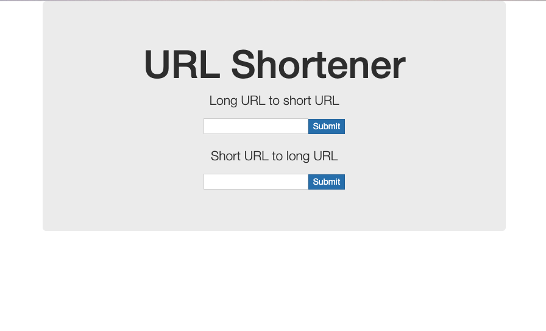

## URL 短连接系统

### 用Go实现一个URL短连接系统，类似于 http://dwz.cn/ ，采用 https://github.com/gin-gonic/gin 这个框架

1. 第1阶段可以先在单进程实现，长短url实现在存放在进程内就好
2. 第2阶段可以将长短url的关联关系放到MySQL中，MySQL驱动采用https://github.com/jinzhu/gorm
3. 第3阶段为了提高性能，将热点url放到Redis中缓存，全量数据仍然放到MySQL中 https://github.com/go-redis/redis
4. 每一阶段实现完，做压测、性能调优。没有实验环境的可以尝试使用阿里云

### Demo

