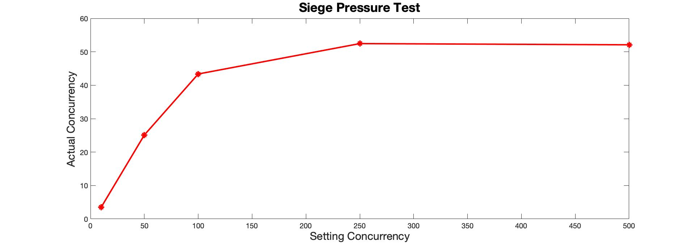

## Siege 压力测试报告

### Stage 1

| ID   | Setting Concurrency | Actual Concurrency | Availability | Transactions (hits) | Response time (secs) | Transaction rate (trans/sec) | Successful transactions | Failed transactions |
| ---- | ------------------- | ------------------ | ------------ | ------------------- | -------------------- | ---------------------------- | ----------------------- | ------------------- |
| 1    | 10                  | 3.54               | 35.71%       | 65                  | 3.24                 | 1.09                         | 65                      | 117                 |
| 2    | 50                  | 25.12              | 36.83%       | 365                 | 4.11                 | 6.12                         | 365                     | 626                 |
| 3    | 100                 | 43.37              | 34.63%       | 418                 | 4.14                 | 7.07                         | 418                     | 789                 |
| 4    | 250                 | 52.46              | 25.57%       | 634                 | .09                  | 10.71                        | 634                     | 1845                |
| 5    | 500                 | 52.10              | 20.74%       | 770                 | 4.02                 | 12.94                        | 770                     | 2942                |

#### 结果分析：

* 因为是直接在前端页面利用CDN加载React库，耗费了大量的时间
* 长短链接的储存都在内存中进行，效率较低
* 只使用了单进程实现，这种I/O密集型操作更适合使用goroutine实现

### Stage 2

